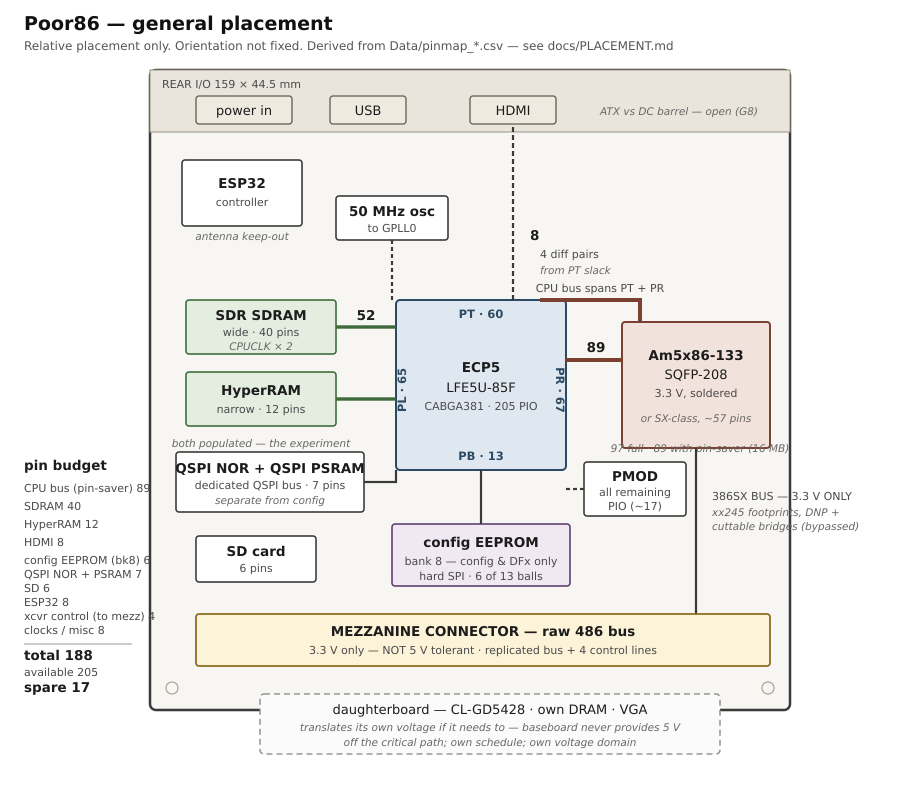

# Pseudo-schematic and general placement

**General placement only.** Orientation and exact geometry are not fixed
here; what is fixed is which block connects to which FPGA edge, because
that is what determines routing difficulty and it is derivable now from
data rather than discovered during layout.

Derived from `Data/pinmap_*.csv` — see [BOARD.md](BOARD.md) for the
gates this feeds.

---

## Pin budget (gate G3)

Counted from the datasheet-derived CSVs, not estimated.

| block | pins |
|---|---:|
| CPU bus — Am5x86, essential set | **97** |
| SDRAM, wide group — **CPUCLK × 2** (~66 MHz) | 40 |
| HyperRAM, narrow group | 12 |
| HDMI, 4 differential pairs | 8 |
| config EEPROM (bank 8, hard SPI) | 6 |
| dedicated QSPI bus — NOR + PSRAM, 2 chip selects | 7 |
| SD card, 4-bit | 6 |
| ESP32 link | 8 |
| Mezzanine transceiver control | 4 |
| Clocks (50 MHz osc on GPLL0), reset, config, misc | 8 |
| **total** | **190** |
| available, CABGA381 PIO | 205 |
| **spare** | **15** |

**The CPU bus is 97 pins, not the ~76 assumed earlier** — that figure was
for a 386SX-class bus. The Am5x86 essential set is 30 address + 32 data
+ 35 control.

**And the full Am5x86 signal set does not fit.** Routing all 113 signals
— adding `DP0-3` parity, JTAG, and the deferrable control group
(`IGNNE`, `FERR`, `UP`, `STPCLK`, `SRESET`, `SMI`, `SMIACT`, `CLKMUL`) —
totals 206 against 205 available. It misses by one pin.

So a choice is forced, and it is cheap — and the schematic has already
made two of them:

- **JTAG is on a CH552T**, not the FPGA (`external_perif.kicad_sch`), so
  it was never in the budget.
- **A "pin saver option" is annotated on the FPGA and Am5x86 sheets**:
  dropping `A24-A31` reduces the address space to 16 MB and the CPU bus
  to **89 pins**, taking the total to **182 of 205 — 23 spare.** 16 MB is
  already the ceiling on the SX-class path, so this makes the two CPU
  variants agree rather than diverge.

Parity remains the other easy candidate; most chipsets do not implement
it.

### Decided: the signal set to carry (G1)

Verified against `Data/am5x86_Microprocessor_Family_Datasheet.pdf` and
`Data/pinmap_am5x86_sqfp208.csv`. **Direction matters** — an input needs a
defined level, an output may simply be left open.

**Cut — not routed to the FPGA (13 signals):**

| signal | n | disposition | why |
|---|:-:|---|---|
| `TCK` `TMS` `TDI` `TDO` | 4 | **tie `TMS`/`TDI` high, `TCK` low; `TDO` open** | unusable without BSDL. **Not floated** — there is no `TRST#` here, so the TAP is held reset by `TMS` high with `TCK` static. A floating TAP can enter a scan state and **drive the bus** |
| `DP0-3` | 4 | leave open | parity unimplemented, as in most period chipsets |
| `PCHK` | 1 | **leave open — it is an output** | nothing listens; the CPU does not trap on parity |
| `SMI` `SMIACT` | 2 | **`SMI` needs no strap — internal pull-up**; `SMIACT` is an output | see the SeaBIOS evidence below |
| `STPCLK` | 1 | tie inactive | stop-clock power management, not used |

**Straps on the board — inputs, so they need a defined level:**

| signal | n | why |
|---|:-:|---|
| `UP` | 1 | upgrade-present; no upgrade socket exists |
| `CLKMUL` | 1 | selects the multiplier — a build-time property of the CPU, not a chipset signal |

> **`PCD` and `PWT` cannot be strapped — they are outputs.** The
> datasheet is explicit: *"the CPU ignores the PCD bit and drives the PCD
> **output** Low"*, and the same for `PWT`. They reflect page-table
> attributes outward, so the only choices are **route** or **leave open**
> — and they are **routed**, per the table below.

**Kept, against the earlier suggestion to cut them:**

| signal | n | why kept |
|---|:-:|---|
| `BS8` `BS16` | 2 | retained by decision — dynamic bus sizing stays available even though the FPGA could width-convert internally |
| `BREQ` `BOFF` | 2 | retained; keeps genuine multi-master arbitration open rather than assuming a single master forever |
| `PLOCK` | 1 | output, retained |
| **`SRESET`** | 1 | **retained — the earlier cut was wrong.** It was filed with the SMM signals, but SMBASE is only one of five things it spares: *"unlike RESET, does not cause it to sample `UP` or `WB/WT`, or affect the FPU, cache, CD and NW bits in CR0, and SMBASE."* **`RESET` re-samples the configuration straps; `SRESET` does not** — so it is the chipset's lighter CPU-only reset, and it is the mechanism by which a warm reboot need not disturb cache mode or FPU state. Input with an **internal pull-down**, so it is inactive if left open — cheap either way, and cheaper to have |
| **`PCD` `PWT`** | 2 | **retained for L2 correctness.** They carry the page-table cacheability attributes outward, and an L2 that ignores them will cache pages the OS marked uncacheable — memory-mapped device windows, and a shared framebuffer if video ends up in main memory. That is a **correctness** failure, not a performance one, and it is invisible until something reads stale data. Feeds the policy open in [PLAN_OF_RECORD.md](PLAN_OF_RECORD.md) |
| **`FERR` `IGNNE`** | 2 | **required for DOS.** The legacy x87 error path is `FERR#` → IRQ13 → BIOS handler → port `0xF0` → `IGNNE#`, which is the PC-compatible mechanism whenever `CR0.NE=0` — the DOS default. Cutting these breaks x87 exception handling on a machine built to run period software |

#### Evidence that `SMI` is safe to cut

**SeaBIOS cannot use SMM on this platform.** From the source at
`rel-1.17.0`: `smm_setup()` reaches only two implementations,
`piix4_apmc_smm_setup(int isabdf, int i440_bdf)` and
`ich9_lpc_apmc_smm_setup(int isabdf, int mch_bdf)`. Both take **PCI**
bus/device/function arguments and drive the chipset through
`pci_config_readl`/`pci_config_writeb`, against PIIX4/i440FX or ICH9/Q35
specifically.

**This machine has no PCI** — established independently with `-M isapc`.
There is no path by which SeaBIOS reaches SMM here, so the condition
*"cut unless SeaBIOS does or can use it"* resolves to **cut**.

#### Where it lands

| set | signals |
|---|---:|
| full Am5x86 | 113 |
| cuts above | −12 |
| straps (`UP`, `CLKMUL`) | −2 |
| **routed to the FPGA** | **99** |
| with the `A24-A31` pin-saver | **91** |

Composition check: 30 address + 32 data + 37 control = 99, the 37 being
the 43 control signals less `PCHK`, `SMI`, `SMIACT`, `STPCLK` (cut) and
`UP`, `CLKMUL` (strapped). **`PCD`, `PWT` and `SRESET` are inside that
37.**

> **Why `RESET` alone is not sufficient.** A full `RESET` re-samples
> `UP` and `WB/WT`, which means it re-latches the cache mode. That
> interacts directly with the coherency policy open in
> [PLAN_OF_RECORD.md](PLAN_OF_RECORD.md): if `WB/WT` is ever driven by
> the chipset rather than statically strapped, **`RESET` becomes the
> instrument that changes cache mode and `SRESET` the one that does
> not.** Losing that distinction would have cost a capability for one
> pin.

---

## FPGA edge allocation

The CABGA381 has 205 PIO balls, distributed very unevenly:

| die edge | balls | A/B differential pairs |
|---|---:|---:|
| PT (top) | 60 | 29 |
| PL (left) | 65 | 16 |
| PR (right) | 67 | 17 |
| PB (bottom) | **13** | 6 |

**A 97-pin CPU bus fits on no single edge.** Only two adjacent pairs are
large enough — PT+PR (127) or PT+LEFT (125) — so **the CPU sits at a
corner of the package**, not centred on a face. That is the single most
consequential placement fact available today.

| FPGA edge | allocated | pins | why |
|---|---|---:|---|
| **PT + PR** | CPU bus | 97 of 127 | only adjacent pair large enough |
| **PL** | SDRAM + HyperRAM | 52 of 65 | both memories on one edge, one face of the FPGA |
| **PB** | **configuration EEPROM only** | 6 of 13 | bank 8 *is* the configuration bank — see below |
| leftovers | HDMI, ESP32, SD, transceiver control, clocks | ~34 of ~49 | distributed into PT/PR/PL slack |

### PB is the configuration bank — and is now formally reserved

**Bank 8 is reserved for configuration and DFx only**, recorded in
[PLAN_OF_RECORD.md](PLAN_OF_RECORD.md). Anything else there requires a
waiver.

All 13 balls of bank 8 carry configuration functions:

```
D0-D7 / IO0-IO7      SPI flash data
MOSI, MISO, MOSI2, MISO2
CSSPIN, CSON, CS1N, SN/CSN
HOLDN/DI/BUSY/CEN, DOUT, WRITEN
```

This is the interface the ECP5 boots through, so the **SPI NOR flash
belongs here and nothing else can have it.** It also happens to be
exactly where the QSPI PSRAM goes, since that part shares the flash bus
by design — so bank 8 hosts both, and the "one extra chip select" costs
one of its spare balls.

**HDMI therefore does not go on PB.** It takes 8 balls from the slack on
whichever of PT/PR/PL faces the rear panel.

### HDMI needs differential pairs, not true LVDS

**Fake TMDS does not require true LVDS. The restriction is on
differential pairs.**

So the constraint is not which banks support LVDS output — it is whether
adjacent **A/B PIO pair sites** are available, since the two halves of
each pair must be matched or skew destroys the signal at these rates.

HDMI needs **4 pairs** (3 data, 1 clock). Pair sites by edge:

| edge | A/B pair sites | enough for HDMI |
|---|---:|---|
| PT | 29 | yes |
| PR | 17 | yes |
| PL | 16 | yes |
| PB | 6 | **reserved — bank 8** |

Every usable edge has ample pairs. Bank 8 is excluded because it is
reserved for configuration and DFx, not because of its pair count.

> **Correction — pair count is not the binding constraint.** This
> previously read *"HDMI placement is free among PT/PL/PR"*. That is
> wrong. Emulated differential output is available on every bank, but the
> **output gearing is on the left and right sides only** — the top side
> supports 1x gearing only, which caps it at **500 Mb/s**, or 800×600.
> 1024×768 needs a geared edge and a -7 part; 720p needs a geared edge and
> a -8 part. See [FAKE_TMDS.md](FAKE_TMDS.md) for the datasheet quotes and
> the mode table. **HDMI on PT is a permanent 800×600 ceiling**, which is
> a board-spin decision rather than a bitstream one.

**No VCCIO constraint either: every VCCIO rail is 3.3 V.** With a single
I/O voltage across the device there is no bank-sharing conflict to
resolve, so HDMI, the CPU bus and the memory groups can be assigned by
geometry alone.

---

## Board floorplan



*(ASCII version below, for diffing.)*

Relative placement only. Rear I/O at the top. The FPGA is oriented with
**PT toward the rear** (so HDMI has a short run to its connector), **PB
downward** toward the SPI flash it must serve, **PL** facing the memory
and **PR** facing the CPU.

```
        +==================== 170 mm =====================+
        |  [DC in]      [USB]        [HDMI]   REAR I/O    |
        |      |          |             |                 |
        |   power      ESP32            | HDMI: 8 from    |
        |   section                     | PT slack        |
        |                          +----+----+            |
        |    SDRAM  ---------------|   (PT)  |            |
        |                          |         |    Am5x86  |
        |    HyperRAM -------------| (PL)ECP5|  +-------+ |
   170  |                          |    (PR) |--| SQFP  | |
   mm   |         memory: 52 pins  |         |  |  208  | |
        |         on PL            |   (PB)  |  +-------+ |
        |                          +----+----+   CPU bus  |
        |                               |        97 pins  |
        |                    SPI NOR + QSPI PSRAM         |
        |                    (bank 8 = config bank)       |
        |                                                 |
        |    SD                                           |
        |                                                 |
        |   ========== MEZZANINE CONNECTOR ==========     |
        |     386SX bus, 3.3 V + 4 xcvr-control lines   |
        +=================================================+
            daughterboard: transceivers + level translation
                           CL-GD5428 + own DRAM + VGA
```

### Rationale

- **CPU at the FPGA's PT/PR corner.** Forced — no single edge holds 97
  pins. The CPU package sits diagonally off that corner so both edges
  face it.
- **Memory on PL**, the opposite face, keeping the two widest buses on
  opposite sides of the FPGA so they do not cross.
- **SPI NOR and QSPI PSRAM on PB**, because bank 8 is the configuration
  bank and the FPGA boots through it. Not a placement choice — a
  constraint.
- **HDMI from the slack on whichever big edge faces the rear panel**,
  preferring adjacent A/B pair sites for skew.
- **Mezzanine at the board edge.** The transceivers are on the
  daughterboard, so the baseboard passes the raw bus to the connector and
  keeps a single 3.3 V domain.
- **ESP32 near the rear** for antenna keep-out, away from the CPU bus.
- **SD wherever slack allows** — few pins, latency-insensitive.
- **The CPU on the side away from the rear panel**, which keeps the
  hottest part clear of the connector stack and puts it next to the
  mezzanine it shares a bus with.

---

## Open

- [ ] **Which of PT+PR or PT+PL carries the CPU.** Both fit. The choice
      is decided by where the CPU can physically sit given the rear I/O
      and the mezzanine, not by ball count.
- [ ] **Which edge carries HDMI** — now a capability question, not a
      geometry one. PT caps video at 800×600 (1x gearing); PL/PR reach
      1024×768 or 720p depending on speed grade, but both already carry a
      wide bus. Blocked on the display-acceptance test in
      [FAKE_TMDS.md](FAKE_TMDS.md): if 640×480 is accepted, PT is fine and
      costs nothing.
- [ ] **Speed grade of the LFE5U-85F**, which is recorded nowhere and now
      has a video consequence: -6 tops out at 800×600, -7 at 1024×768, -8
      at 720p.
- [ ] **Bank VCCIO grouping** against the 3.3 V CPU bus and the video
      pairs — banks sharing a VCCIO rail must share a voltage.
      `Data/pinmap_ecp5_cabga381_power.csv` has the rails.
- [ ] **Which 8 signals are dropped** to bring the full Am5x86 set inside
      205, if more than the essential 97 are wanted.
- [ ] Whether video gets its own memory channel — would add a narrow
      group and eat most of the 15 spare pins.
- [ ] SX-class variant: its bus is ~57 pins rather than 97, so the same
      allocation holds with slack. No separate floorplan needed.
